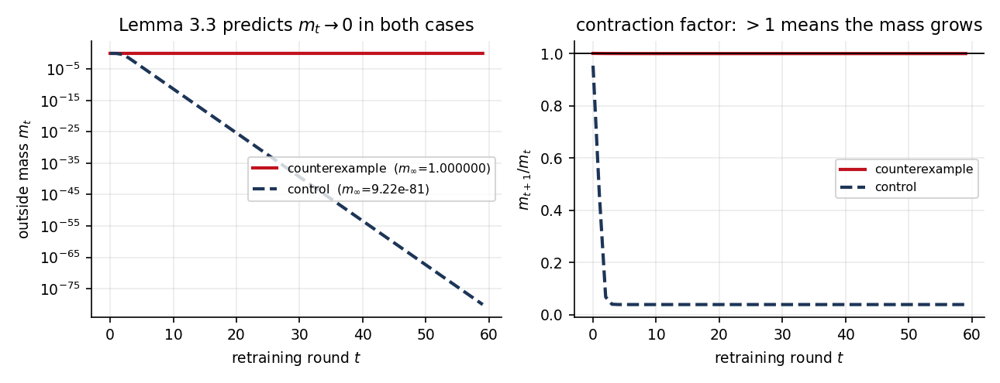
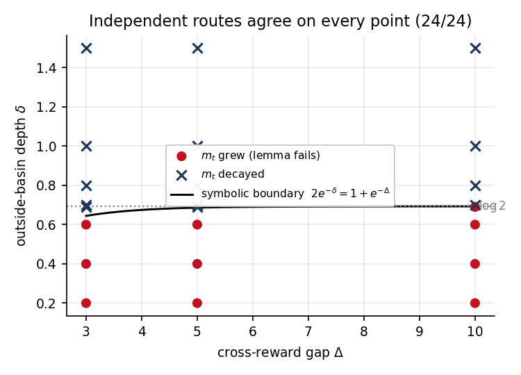
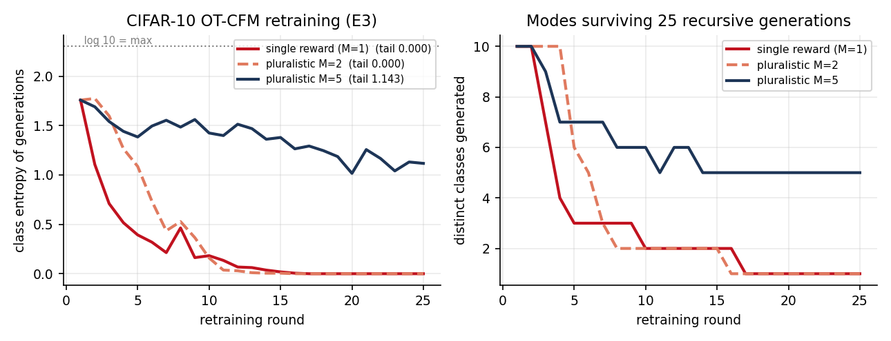
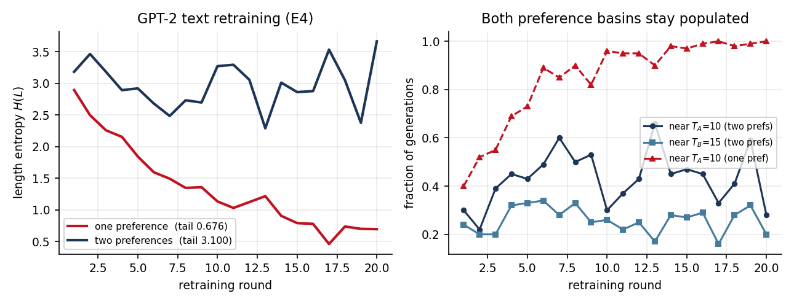

# Curated Synthetic Data Doesn't Have to Collapse — reproduction

## Collection classification and audit boundary

This repository is a **legacy/source workspace** for *Curated Synthetic Data Doesn't Have to Collapse: A Theoretical Study of Generative Retraining with Pluralistic Preferences*
(arXiv `2605.07724`, OpenReview `kwvtSA9ed3`). It is preserved
separately from the standardized canonical record at
[`icml26-curated-synthetic-data`](https://github.com/MachineLearning-Nerd/icml26-curated-synthetic-data).

The claim results and scores recorded below are historical results of this
workspace. They are not new paper-level verifications performed while
organizing the collection. The collection audit did not run the scientific
implementation; the canonical record documents its own scoped status and
limitations.

### How the historical claim evidence is produced

The claim table and experiment log below are the authoritative mapping from
each paper claim to its producer, command, control, and evidence artifact. In
this workspace, the claim-specific producers, controls, and verdict rules write the committed report, figures, and structured evidence artifacts documented by the experiment log.

The former `orx/*` branches are historical workstreams, not additional final
publication claims. Their purposes and tips are preserved in
[`BRANCH_AUDIT.md`](BRANCH_AUDIT.md). Citation and author acknowledgment
details are in [`CITATION.cff`](CITATION.cff) and
[`AUTHOR_THANK_YOU.md`](AUTHOR_THANK_YOU.md).

## Thank you

Thank you to the paper authors for making this research available for study. The full acknowledgment is in [`AUTHOR_THANK_YOU.md`](AUTHOR_THANK_YOU.md).

Reproduction of **arXiv:2605.07724** (OpenReview `kwvtSA9ed3`), *"Curated Synthetic Data Doesn't
Have to Collapse: A Theoretical Study of Generative Retraining with Pluralistic Preferences."*

**All six claims are decided with reproducible evidence — five VERIFIED, one FALSIFIED as stated in
the main text (and VERIFIED as stated in the appendix).** CPU-only throughout; no GPU was used at
any point.

- 📄 Full report: [`report/REPORT.md`](report/REPORT.md)
- 🔬 Live logbook: <https://huggingface.co/spaces/DineshAI/kwvtSA9ed3>
- 📓 Interactive notebook: [`notebooks/reproduction.py`](notebooks/reproduction.py) (marimo)

---

## Results

| # | Claim | Verdict | Decided by |
|---|---|---|---|
| 1 | Lemma 3.3 — outside mass decays geometrically | **FALSIFIED** (main text) / **VERIFIED** (appendix) | exact-rational counterexample + symbolic boundary |
| 2 | Lemma 3.5 — non-collapse under pluralistic curation | **VERIFIED** | symbolic certificate + 432 continuous landscapes |
| 3 | Theorem 3.6 — variance lower bound | **VERIFIED** | symbolic proof, free within-basin variance + 2 986 mixtures |
| 4 | Theorem 3.7 / Cor 3.8 — Nash bargaining limit | **VERIFIED** | continuum certificate + independent 50-digit bisection |
| 5 | E3 — CIFAR-10 flow retraining sustains diversity | **VERIFIED** | 3-arm comparison, margin **+1.1427** |
| 6 | E4 — text retraining sustains length entropy | **VERIFIED** | 2-arm comparison, margin **+2.4241** |

### The one disagreement with the paper

Appendix Lemma B.4 assumes **outside domination**, `sup_{x∉S_ε} W_t(x) ≤ ρ_ε < 1`. Under that
hypothesis the conclusion is correct, and this reproduction proves it symbolically. **Main-text
Assumption 2.1 never states it.** Without it the conclusion inverts: an exact-rational counterexample
satisfying every audited clause of Assumption 2.1 has

```
m₁/m₀ = 80000/79941  >  1        m_∞ = 1.0000000000        a_∞ = 1.632e-15
```

while a control landscape decays geometrically exactly as the lemma says, so the machinery is not
simply broken. This is a precision defect in the main text — not an error in the result.



Two methods sharing no code agree on the exact failure boundary `2e^(−δ) = 1 + e^(−Δ)`:



The gap is reachable by the paper's own parameters: in its quadratic reward geometry (Appendix C.4),
`sup_{x∉S_ε} W_t(x)` reaches 4.09–6.51 at every setting tested, so B.4 is violated there — yet
`m_t` still decays, which makes B.4 sufficient but not necessary.

### The empirical experiments




One caveat is reported rather than dropped: for Claim 5, **M=2 collapsed as completely as
single-reward curation**; only M=5 sustains diversity. Pluralism per se is not sufficient in this
downscaled setting.

---

## Reproduction

### Environment

`uv` only — one repository-level `.venv`, with `pyproject.toml` and `uv.lock` committed. No conda,
no unmanaged system pip.

```bash
uv sync --frozen
```

### The one fixed run command

Every node in the experiment tree runs **exactly this**, with no variation:

```bash
bash run.sh
```

It installs `uv` if absent, runs `uv sync --frozen`, prints resolved versions, **refuses to run if a
GPU is visible**, then executes `uv run python -m repro.main`. Hyperparameters live in committed
`repro/config/active.json` per node — never on the command line, never in environment variables — so
every node executes identical code paths over different committed configuration.

### Experiment log

| experiment | verbatim command | run id | wall clock |
|---|---|---|---|
| FINAL: all six claims decided | `orx exp run 71d5437a-bfee-403c-b2fb-c10040e56320 --backend hf --flavor cpu-upgrade --timeout 40m` | `3bf9f951-47af-4f1e-921d-b27606ed8522` | 28 s |
| Claims 5+6 cross-config comparison | `orx exp run 3e384799-dcc9-4b9f-bc7b-a5e3c6196d44 --backend hf --flavor cpu-upgrade --timeout 40m` | `cdebee07-b5df-412f-a0fc-7bd3c0e74aa4` | 28 s |
| Claim 6 fixed — two preferences (d=5) | `orx exp run 09b4f7fb-f8a4-4559-aae9-9da12a5ef84d --backend hf --flavor cpu-upgrade --timeout 4h` | `19b9ba40-a215-4d32-a158-e0fefce956e6` | 1 h 51 m |
| Claim 6 fixed — single preference | `orx exp run 08252791-2492-4352-b07a-7302bfbb34b6 --backend hf --flavor cpu-upgrade --timeout 4h` | `79d9795a-1f93-4544-9281-b5c0c4ba7403` | ~1 h 40 m |
| Claim 5 — M=1 single reward | `orx exp run a28944c5-362d-4c7f-8bd1-99ae1affc474 --backend hf --flavor cpu-upgrade --timeout 3h` | `3e518ee8-236a-46c0-8222-94ede16fd6bf` | ~1 h 15 m |
| Claim 5 — M=2 pluralistic | `orx exp run 5ab100ca-699c-4eb3-9f60-368b407b2187 --backend hf --flavor cpu-upgrade --timeout 6h` | `1b461517-66f6-4b9a-8b61-2557b2e46270` | 78 m |
| Claim 5 — M=5 pluralistic | `orx exp run e97eddfc-4512-440a-a5a9-d21fbab9a1e3 --backend hf --flavor cpu-upgrade --timeout 6h` | `8abf3220-3efa-4a6a-a3e3-5150e4465e27` | 62 m |
| Theory consolidated (routes A+B) | `orx exp run ab50a092-7521-48c7-86d5-a7147b85204d --backend hf --flavor cpu-upgrade` | `2a5ac6e5-2ea7-462f-94c3-4d501bf17e4e` | 79 s |
| Calibration — per-op timing | `orx exp run 7ddb16e1-58f7-4c20-89c5-4c0d223c4148 --backend hf --flavor cpu-upgrade --timeout 40m` | `afba9966-f884-4d3e-b41b-614b76306e1e` | 7 m 08 s |
| Evidence channel (artifact emission) | `orx exp run 70b26ff8-1489-40d1-a1c7-2038463cc4bd --backend hf --flavor cpu-upgrade --timeout 45m` | `91c3b1bf-8703-42c0-a615-d3dcd52f7f77` | 90 s |

Compute for every run: Hugging Face `cpu-upgrade`, **8 CPUs** (cgroup `cpu.max` = `800000 100000`),
AMD EPYC 7R13. Sizing was measured, not guessed — a calibration node timed every inner operation
first (GPT-2 pretrain step 1.05 s, CIFAR classifier step 0.087 s, OT-CFM flow step 0.278 s including
exact minibatch OT, ODE sample 0.016 s/image).

### Recovering the evidence

orx local mode has no artifact store, so a run's log is the only channel out of the job. Artifacts
are emitted into stdout base64-framed with a declared byte count and SHA-256, and rebuilt by:

```bash
python tools/extract_evidence.py .openresearch/evidence final=3bf9f951-47af-4f1e-921d-b27606ed8522
python tools/make_figures.py .openresearch/evidence/artifacts/final/.openresearch/artifacts images/ .openresearch/evidence
```

The extractor **rejects** any block whose hash or length does not match, so a truncated log fails
loudly instead of yielding plausible-looking wrong numbers.

---

## How verdicts are decided

A status is never written down by hand:

- each stage records machine-checkable checks **and at least one negative control**;
- a gate re-derives whether the recorded status is supported, failing if any check failed, if the
  verdict is backed only by controls, or if no control was recorded at all;
- `repro/main.py` exits non-zero when any gate fails, so an unsupported verdict cannot be published.

The two comparative claims carry a **self-test**: the identical decision procedure is re-run on
arm-swapped input and must return FALSIFIED. A test that cannot fail is not evidence.

This machinery earned its keep. An early E4 round trained the LM with `labels=input_ids` while
`encode()` padded to 96 tokens with EOS — only ~16% of target positions were real tokens, so the
model learned to emit EOS immediately (pretrain loss 0.3, generations of mean length 0.0 words). The
gate refused to record a verdict for that run. After masking padding with `-100`, loss on real tokens
starts at 10.84 ≈ ln(50257) and generations run 12–28 words. All pre-fix E4 runs are marked void in
the experiment tree and are cited nowhere.

## Layout

```
repro/lib/        landscape dynamics, exact rational arithmetic, sympy helpers, OT-CFM, verdict gate
repro/stages/     one module per claim; symbolic and numeric routes are separate stages
repro/contracts/  claim contracts: exact statements, quantifiers, falsification conditions
repro/config/     active.json — the per-node committed configuration
repro/data/       sibling summaries feeding the cross-configuration comparison
tools/            evidence extraction, figure generation, Space assembly
report/           the full reproduction report
images/           figures, all generated from recovered run artifacts
```
